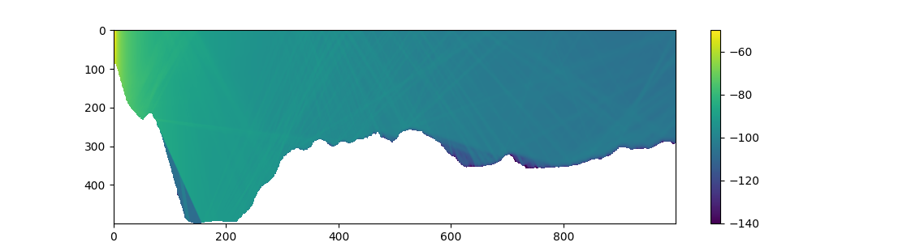
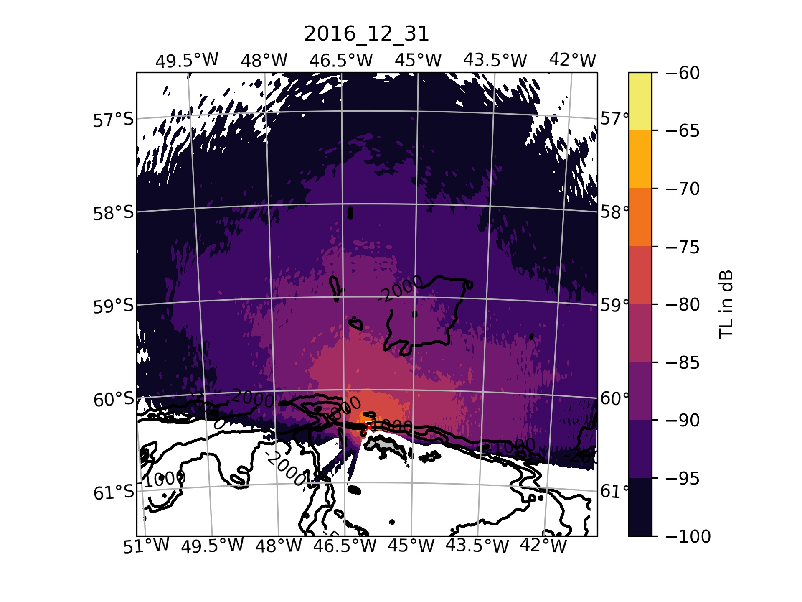
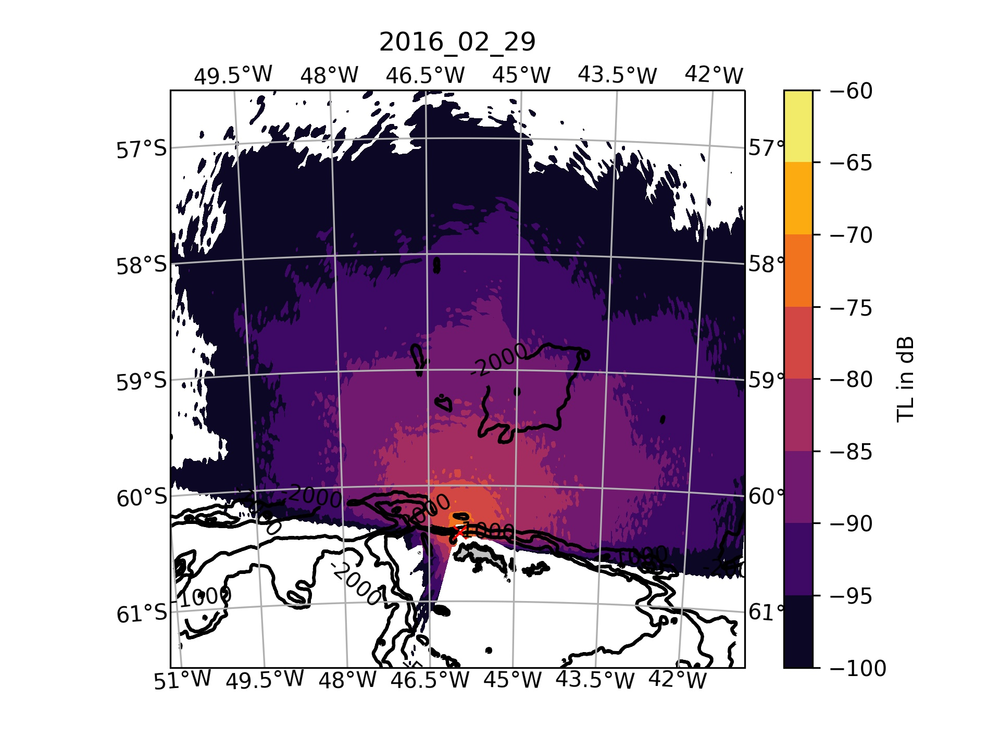
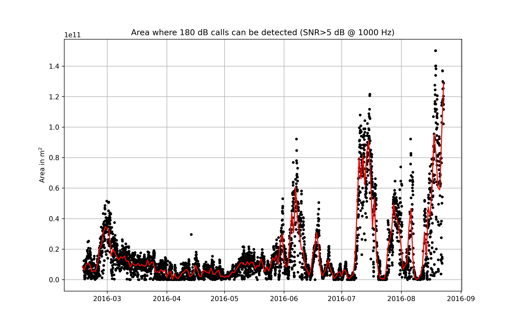
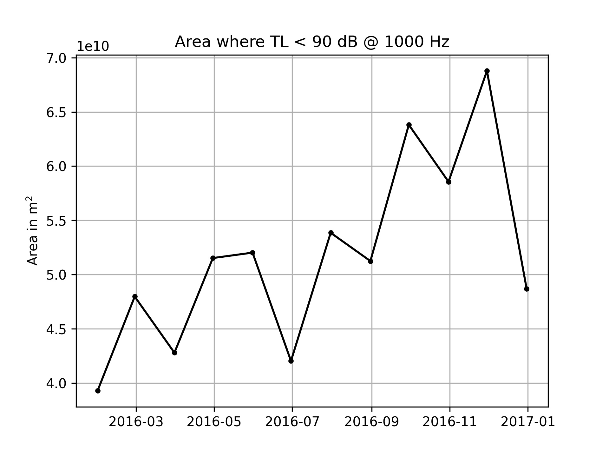

# Modeling the detection range of moored underwater recorders - using python, acoustic propagation models and ocean reanalysis data 

Passive acoustic recordings are often used to detect and count the number of animal calls per unit-time, also termed "call rate". The recorded call rate is not only influenced by the number and behavior of the calling animals, but the size of the area that is "audible" to the recorders (where arriving calls have a signal-to-noise-ratio > 1). This measure is also often termed the detection range and depends on the transmission loss between source and recorder and the local noise level. In this tutorial I am calculating the detection area for a mooring in the Southern Ocean, and use GEBCO bathymetry (https://www.gebco.net/) to model the sea-floor and Copernicus ocean-reanalysis data to model the soundspeed (https://resources.marine.copernicus.eu/product-detail/GLOBAL_MULTIYEAR_PHY_001_030/INFORMATION). These datasets can be downloaded as netcdf files wither through the websites or with a python client. 

## Transmission Loss (TL) modeling

Many underwater sound propagation models exist, a useful source is this website: https://oalib-acoustics.org/. In this tutorial I am using the ray-tracing model "Bellhop", as it is very established and somewhat easy to use. A python wrapper for Bellhop can be found here: https://github.com/org-arl/arlpy.

The standard models have only two-dimensions: depth and range, in order to estimate the 3D transmission loss, we can rotate 2D slices around our mooring. This approach is often termed 2xN D modeling. While it ignores some lateral propagation effects it is a valid first approach. 

First I load the necessary modules and extract the batymetry profiles for 500 km long slices in 1 degree intervals around the recorder. The frequency of the model is set to 50 Hz in this example. 

```python
import h5py
from scipy import interpolate
import pandas as pd
import numpy as np
import matplotlib.pyplot as plt
import datetime as dt
import glob 
import os
import sys
import gsw
from netCDF4 import Dataset
import pandas as pd
import cartopy
import cartopy.crs as ccrs
from scipy.ndimage import gaussian_filter
import arlpy.uwapm as pm
import pyresample
from pyproj import Geod

os.chdir(r'D:\passive_acoustics\propagation_modelling')

modelfrec=50

# load data and slice out region of interest

latlim=[-62,-56]
lonlim=[-(46+5),-(46-5)]

spacer=1
gebcofile=r"C:\Users\a5278\Documents\gebco_2020_netcdf\GEBCO_2020.nc"
gebco = Dataset(gebcofile, mode='r')
g_lons = gebco.variables['lon'][:]
g_lon_inds = np.where((g_lons>=lonlim[0]) & (g_lons<=lonlim[1]))[0]
# jump over entries to reduce data
g_lon_inds=g_lon_inds[::spacer]

g_lons = g_lons[g_lon_inds]
g_lats = gebco.variables['lat'][:]
g_lat_inds = np.where((g_lats>=latlim[0]) & (g_lats<=latlim[1]))[0]
# jump over entries to reduce data
g_lat_inds=g_lat_inds[::spacer]

g_lats = g_lats[g_lat_inds]
d = gebco.variables['elevation'][g_lat_inds, g_lon_inds]
gebco.close()

#%% get bathymetry slices
lo,la=np.meshgrid(g_lons, g_lats)
grid = pyresample.geometry.GridDefinition(lats=la, lons=lo)

m_loc=[-( 45+57.548/60) , -(60+24.297/60)]
geod = Geod("+ellps=WGS84")

bearings=np.arange(360)

bathy_dict={}
points_lat=pd.DataFrame()
points_lon=pd.DataFrame()

for b in bearings:
    print(b)

    points = geod.fwd_intermediate(lon1=m_loc[0],lat1=m_loc[1],azi1=b,npts=500,del_s=1000 )
    p_lon=points[3]
    p_lat=points[4]
    points_lat=pd.concat( [points_lat,pd.DataFrame(p_lat)],ignore_index=True,axis=1 )
    points_lon=pd.concat( [points_lon,pd.DataFrame(p_lon)],ignore_index=True,axis=1  )
    
    swath = pyresample.geometry.SwathDefinition(lons=p_lon, lats=p_lat)
    
    
    # Determine nearest (w.r.t. great circle distance) neighbour in the grid.
    _, _, index_array, distance_array = pyresample.kd_tree.get_neighbour_info(
        source_geo_def=grid, target_geo_def=swath, radius_of_influence=500000,
        neighbours=1)
    # get_neighbour_info() returns indices in the flattened lat/lon grid. Compute
    # the 2D grid indices:
    index_array_2d = np.unravel_index(index_array, grid.shape)
    
    value = d[index_array_2d[0],index_array_2d[1]] 
    
    dvec=np.arange(0,1000*500,1000)
    bb=np.transpose(np.array([dvec,-value.data]))    
    bathy_dict[b]=    bb.tolist()

timevec = pd.Series( pd.date_range(start=pd.Timestamp('2016-01-01'),end=pd.Timestamp('2017-01-01'),freq='M') )

```

Now I have the bathymetry profiles stored in the dictionary "bathy_dict". Next I can get the sound speed profiles for a set of dates (here i chose 1-month steps) and run the TL model for each date and 360 degre slice:

```python
#%%
datestr=timevec[7]

tl_mat_dict={}
tl_map_dict={}


for datestr in timevec:

    ncfile=r"D:\copernicus_data\\"  + datestr.strftime('%Y-%m-%d')  + r"_ocean_reanalysis.nc"
    nc = Dataset(ncfile)
    
    
    la,lo=np.meshgrid(nc['latitude'][:].data, nc['longitude'][:].data)
    grid = pyresample.geometry.GridDefinition(lats=la, lons=lo)
    
    m_loc=[-( 45+57.548/60) , -(60+24.297/60)]
    
    geod = Geod("+ellps=WGS84")
    
    bearings=np.arange(360)
    
    z_ss_dict={}
    rp_ss_dict={}
    cw_dict={}
    points_lat=pd.DataFrame()
    points_lon=pd.DataFrame()
    
    tl_mat_ray=pd.DataFrame()
    lat_mat_ray=pd.DataFrame()
    lon_mat_ray=pd.DataFrame()
        
    for b in bearings:
        print(b)
    
        points = geod.fwd_intermediate(lon1=m_loc[0],lat1=m_loc[1],azi1=b,npts=500,del_s=1000 )
        p_lon=points[3]
        p_lat=points[4]
        points_lat=pd.concat( [points_lat,pd.DataFrame(p_lat)],ignore_index=True,axis=1 )
        points_lon=pd.concat( [points_lon,pd.DataFrame(p_lon)],ignore_index=True,axis=1  )
        
        swath = pyresample.geometry.SwathDefinition(lons=p_lon, lats=p_lat)
        
        
        # Determine nearest (w.r.t. great circle distance) neighbour in the grid.
        _, _, index_array, distance_array = pyresample.kd_tree.get_neighbour_info(
            source_geo_def=grid, target_geo_def=swath, radius_of_influence=500000,
            neighbours=1)
        # get_neighbour_info() returns indices in the flattened lat/lon grid. Compute
        # the 2D grid indices:
        index_array_2d = np.unravel_index(index_array, grid.shape)
        
        
        temp = nc['thetao'][:][0,:,index_array_2d[1],index_array_2d[0]]
        sal = nc['so'][:][0,:,index_array_2d[1],index_array_2d[0] ]
        depth=nc['depth'][:]
        depth_mat=np.tile( depth, [sal.shape[0],1] )
        # depth.shape
        sound_speed = gsw.sound_speed(sal,temp,depth_mat) 
        sound_speed = pd.DataFrame( sound_speed.data )
        sound_speed=sound_speed.fillna(axis=1,method='ffill')
       
        # fig=plt.figure(num=6)
        # plt.clf()   
        # plt.imshow(np.transpose(sound_speed.values[:,:]),aspect='auto')
        # plt.pcolormesh(dvec,-depth,np.transpose(sound_speed.values))
        # plt.boxplot((sound_speed.values))
     
        
        dvec=np.arange(0,1000*500,1000)
    
    
      # ssp2 = sound_speed.astype('int')
        sspdic={}
        i=0
        dd=dvec.copy()
        dd[-1]=dvec[-1]*10
        for rang in dd:
            sspdic[rang]= sound_speed.iloc[i,:].values
            i=i+1
        ssp2=pd.DataFrame(sspdic)   
        
        depth=nc['depth'][:]
        dd=np.array(bathy_dict[b])[:,1].max()
        ixx=depth<dd
        
        ssp3=ssp2.iloc[ixx,:]
        
        dssp=depth.data.astype('int').copy()[ixx]
        dssp[0]=0
        dssp[-1]=dd
        ssp3.index=dssp
       # ssp2 = pd.DataFrame({
       #    0: [1540, 1530, 1532, 1533],     # profile at 0 m range
       #  100: [1540, 1535, 1530, 1533],     # profile at 100 m range
       #  200: [1530, 1520, 1522, 1525] },   # profile at 200 m range
       #  index=[0, 10, 20, 30])             # depths of the profile entries in m
     
        env = pm.create_env2d(
            depth= bathy_dict[b],
            soundspeed=ssp3,
            bottom_soundspeed=1450,
            bottom_density=1200,
            bottom_absorption=1.0,
            tx_depth=200,
            frequency=modelfrec,
            min_angle = -45,
            max_angle=  45)     
        ddarr=np.array(bathy_dict[b])
       
        env['rx_range'] = ddarr[:,0]
        # env['rx_range'] = np.linspace(0, 1000*299, 1000)
        
        env['rx_depth'] = 15
                
        # tloss = pm.compute_transmission_loss(env,mode='incoherent',debug=True)
        tloss = pm.compute_transmission_loss(env,mode='incoherent')

        tloss_dB= 20*np.log10( tloss.abs() )

   
        lats=points_lat.iloc[:,b]
        lons=points_lon.iloc[:,b]
        lat_mat_ray=pd.concat( [lat_mat_ray,lats],axis=1,ignore_index=True )
        lon_mat_ray=pd.concat( [lon_mat_ray,lons],axis=1,ignore_index=True )
    
        tl_mat_ray=pd.concat( [tl_mat_ray,pd.DataFrame(tloss_dB.values[0,:])],axis=1,ignore_index=True )
        
    z=tl_mat_ray.values.flatten()
    y=lat_mat_ray.values.flatten()
    x=lon_mat_ray.values.flatten()
    grid_x, grid_y = np.meshgrid(g_lons, g_lats)      
    pp=np.transpose(np.array([x , y ]))
    tl_circle_mat=interpolate.griddata(pp,z, (grid_x, grid_y),method='linear' )
    tldf=pd.DataFrame(tl_circle_mat)
    tldf.to_hdf('tl_ray_' + str(modelfrec)+ 'hz_'+datestr.strftime('%Y_%m_%d')+'.h5', key='df', mode='w')

   
    tl_mat_dict[datestr.strftime('%Y_%m_%d') ] = tl_mat_ray.copy()
    tl_map_dict[datestr.strftime('%Y_%m_%d') ] = tl_circle_mat.copy()
```
An example TL slice looks like this:



Lets generate maps showing the TL for each date:

```python
for datestr in timevec:
    plt.figure(num=5)
    plt.clf() 

    tl_circle_mat_filt=gaussian_filter(tl_map_dict[datestr.strftime('%Y_%m_%d')], sigma=3)
    
    central_lon= lonlim[0]+(lonlim[1]-lonlim[0])/2
    central_lat = latlim[0]+(latlim[1]-latlim[0])/2
    extent = [lonlim[0]+0.5,lonlim[1]-0.5, latlim[0]+0.5,latlim[1]-0.5]
    #ax = plt.axes(projection=ccrs.PlateCarree(central_longitude= lonlim[0]+(lonlim[1]-lonlim[0])/2 ))
    
    ax = plt.axes(projection=ccrs.Orthographic(central_lon, central_lat))
    
    ax.set_extent(extent)
      
    ax.gridlines(draw_labels=True)
    #ax.coastlines(resolution='50m')
    #ax.add_feature(cartopy.feature.LAND)
    
    d_plot=d.copy()
    d_plot[d<-4000]=-4000
    
    axcf=plt.contourf(g_lons, g_lats, tl_circle_mat_filt.astype(int), np.arange(-100,-55,5),cmap='inferno',
                      linestyles=None, transform=ccrs.PlateCarree())
    
    CS=plt.contour(g_lons, g_lats, d, [-2000,-1000,-500],colors='k',linewidth=.1,
                      linestyles='-', transform=ccrs.PlateCarree())
    plt.clabel(CS, inline=True, fontsize=10, fmt='%i')
    
    CS=plt.contourf(g_lons, g_lats, d, [0,8000],colors='silver',linewidth=1,
                      linestyles='-', transform=ccrs.PlateCarree())
    
    CS=plt.contour(g_lons, g_lats, d, [0],colors='k',linewidth=1,
                      linestyles='-', transform=ccrs.PlateCarree())
    
    plt.title(datestr.strftime('%Y_%m_%d'))
    cb = plt.colorbar(axcf,label='TL in dB')
    plt.plot(m_loc[0],m_loc[1],'xr', transform=ccrs.PlateCarree())
    
    plt.savefig('tl_map_reaytracing_bathy_and_ssp_' + str(modelfrec)+ 'hz_'+ datestr.strftime('%Y_%m_%d') + '.jpg',dpi=300)
```
Here are example for two different months, with differences due to the the effect of temperature and salinity on the sound speed. The red X marks the recorder location.





## Calculating the detection area timeseries for a PAM dataset
Now that we have maps of the TL at differnt dates, we can get the noise time series from our recorded data by calculating spectra averages for each recording snippet:

```python
from scipy.io import wavfile
from scipy import signal


audiofolder=glob.glob(r"I:\postdoc_krill\pam\2016_aural\*.wav")
i=0
flog=np.logspace(1,4,1000)
spec=np.array([])
time=np.array([])

name=audiofolder[0]
for name in audiofolder: 
    print(name) 
    
    t= dt.datetime.strptime( name.split('\\')[-1].split('.')[0] , 'aural_%Y_%m_%d_%H_%M_%S' )
    time=np.append(time,t)
    
    fs, x = wavfile.read(name)  
    db_saturation=155
    x=x/32767 
    p =np.power(10,(db_saturation/20))*x #convert data.signal to uPa    
    f, Pxx = signal.welch(p, fs, window='hamming',nperseg=2**15)
    specint=np.interp(flog,f,Pxx)
    spec=np.append(spec,specint)
specmat=np.reshape(spec,[time.shape[0],flog.shape[0]])
specmat=pd.DataFrame(data=specmat.iloc[1:,:])
specmat.index=time
specmat.columns=flog
```
Than we need to assume a source level for our calling animals and decide wich SNR threshold we deem large enough for a sound to be detectable. Here I choose an SL of 180 dB and an SNR of 5 dB. Than we can loop over our ambient noise timeseries and calcualte the detection area for each recording:

```python
sl_db=180 

az12,az21,dist1 = geod.inv(g_lons[0],g_lats[0],g_lons[0],g_lats[-1])
az12,az21,dist2 = geod.inv(g_lons[0],g_lats[0],g_lons[-1],g_lats[0])

pixel_area= dist1 / g_lats.shape[0] * dist2 / g_lons.shape[0] # sqarementers

ix_f=np.argmin( np.abs( specmat.columns - modelfrec ) )

t=specmat.index[0]
i=0
area_audible=[]
for t in specmat.index:
    noise_db=specmat.iloc[i,ix_f]
    
    ix_tltime= np.argmin( np.abs(timevec - t) ) 
    tl_circle_mat_filt=gaussian_filter(tl_map_dict[timevec[ix_tltime].strftime('%Y_%m_%d')], sigma=3)
    
    snr=sl_db + tl_circle_mat_filt - noise_db
    
    aa=np.sum( snr>5 ) * pixel_area
    area_audible.append(aa)
    i=i+1
area_audible=pd.DataFrame(area_audible)    
area_audible.index=time
# area_audible.to_csv('audible_area_1000hz_sl180_pyram_bathandssp.csv')

plt.figure(num=6)
plt.clf()     
plt.plot(area_audible,'.k')
plt.plot(area_audible.resample('1d').mean(),'-r')
plt.ylabel('Area in m$^2$')
plt.title('Area where 180 dB calls can be detected (SNR>5 dB @ 1000 Hz)')
plt.grid()
    
# plt.savefig('detection_area_timeseries_50hz_bellhop.jpg',dpi=300) 
```
The resulting timeseries looks like this:



We can also just plot the seasonal cycle of the area where TL is smaller than a give values:
```python
noise_db=np.mean( specmat.iloc[:,ix_f] )
    
tl_area=[]    
for datestr in timevec:
    
    tl_circle_mat_filt=gaussian_filter(tl_map_dict[datestr.strftime('%Y_%m_%d')], sigma=3)
    
    aa=np.sum( tl_circle_mat_filt>-90 ) * pixel_area
   
    tl_area.append(aa)

plt.figure(num=7)
plt.clf()      
plt.plot(timevec,tl_area,'.-k')
plt.ylabel('Area in m$^2$')
plt.title('Area where TL < 90 dB @ 1000 Hz')
plt.grid()

# plt.savefig('seasonal_cycle_tl_bellhop_50hz_90dbtl.jpg',dpi=300)
```
As we can see, the TL decreases later in the year, allowing for a larger are to be monitored by the recorder. 

